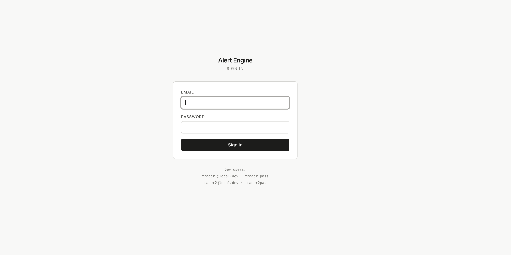
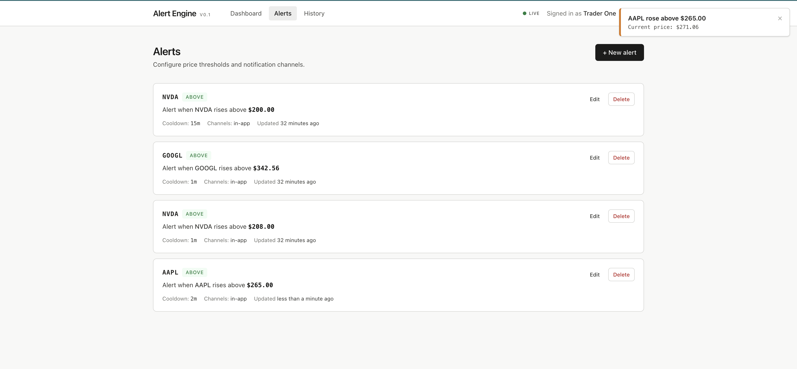
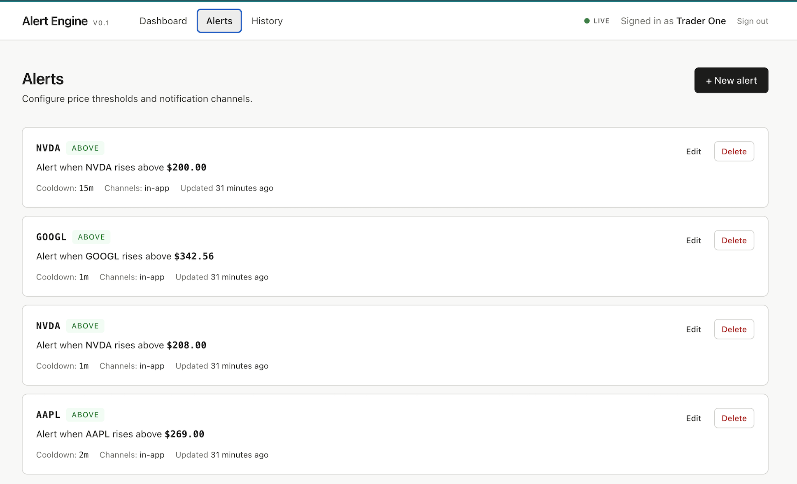
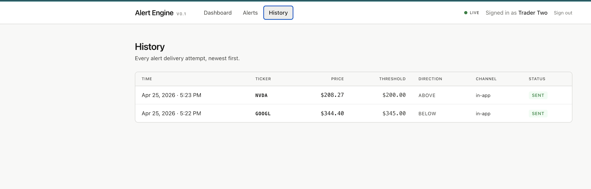
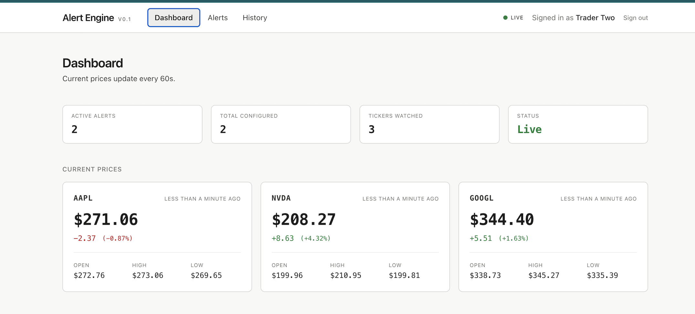
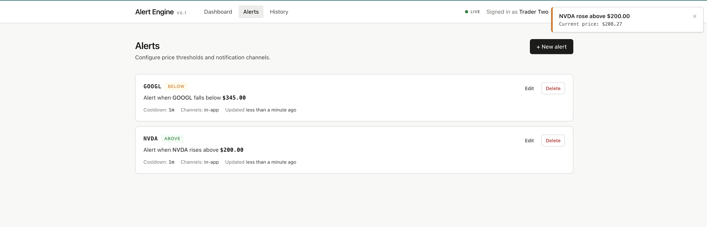
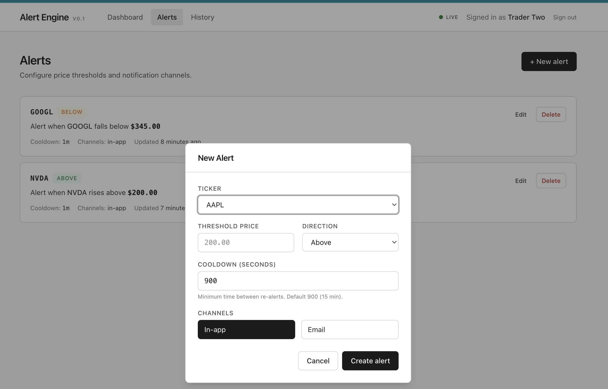

A real-time stock price alert system. 
Traders configure price thresholds for tickers; the backend polls market data, detects threshold crossings, and pushes notifications through in-app and email channels.

## Tech Stack 
Backend
- Java 21, Spring Boot 3.5
- Spring Security + JWT (jjwt)
- Spring Data JPA / Hibernate
- Spring WebSocket (STOMP)
- PostgreSQL 16 with Flyway migrations
- JavaMail (SMTP)

Frontend
- React 18 + TypeScript
- Vite
- Tailwind CSS v4
- TanStack Query (server state)
- Zustand (client state)
- React Router v7
- @stomp/stompjs + sockjs-client

External Services
- Finnhub API (market data)
- Mailtrap (development email sandbox)

## Features
- Real-time price monitoring via the Finnhub API, polled every 60 seconds
- Threshold-based alerts with ABOVE / BELOW direction and once-per-crossing semantics — alerts fire once when the price crosses the threshold and re-arm only when the price returns to the opposite side
- Configurable cooldown per alert to prevent rapid re-firing on price oscillation
- Multi-channel notifications:
   - In-app toasts pushed over WebSocket (STOMP/SockJS)
   - HTML emails via SMTP (Mailtrap in development)

- Full audit trail — every delivery attempt (sent, failed, suppressed) recorded in PostgreSQL
- JWT authentication with bcrypt-hashed passwords and per-user data isolation
- React frontend with live toast notifications, dashboard, alert management, and paginated history

## Alert lifecycle

1. Trader creates a config: notify me when AAPL rises above $200
2. Scheduled poller fetches the latest AAPL quote from Finnhub and upserts price_cache
3. Evaluator compares current price against active configs for that ticker
4. If a threshold is crossed and the config is armed, the dispatcher fans out to configured channels
5. Each channel records its outcome (SENT / FAILED / SUPPRESSED_COOLDOWN) in alert_history
6. The alert is disarmed; it re-arms only when the price returns to the opposite side of the threshold

## Screenshots
### Login Page

### Trader 1 Toast notifications

### Trader 1 active alerts

### Trader 1 alerts history

### Trader 2 Dashboard

### Trader 2 Toast notifications

### Trader 2 alerts configuration

##  Getting Started
1. Setup database
2. Configure your environment variables in SpringBoot
3. Run the backend first, then run the frontend
4. Use the 2 seeded users to Login

## Future Improvements
- The current system is a development-stage MVP. Planned enhancements:
### Authentication and security
 - User registration endpoint and self-service password change
 - httpOnly cookie token storage instead of localStorage
 - Rate limiting on login endpoint
### Alert types
 - Percentage change alerts
 - Volume spike alerts
 - Valuation threshold alerts
### Notification channels
 - SMS via Twilio
 - Slack Webhooks
### Performance and scalability
 - Caching layer (Redis) for frequently accessed price data
 - Replace Finnhub polling with their WebSocket streaming API for sub-second latency
### Operations
 - CI/CD pipeline (GitHub Actions)
 - unit + integration tests with Testcontainers
 - Docker images for backend and frontend
 - Observability
### User Experience
 - Dynamic ticker support — let users add any Finnhub-supported symbol instead of a fixed whitelist
